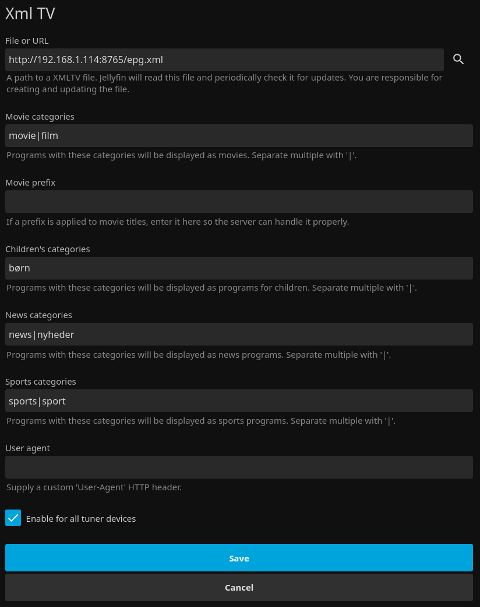
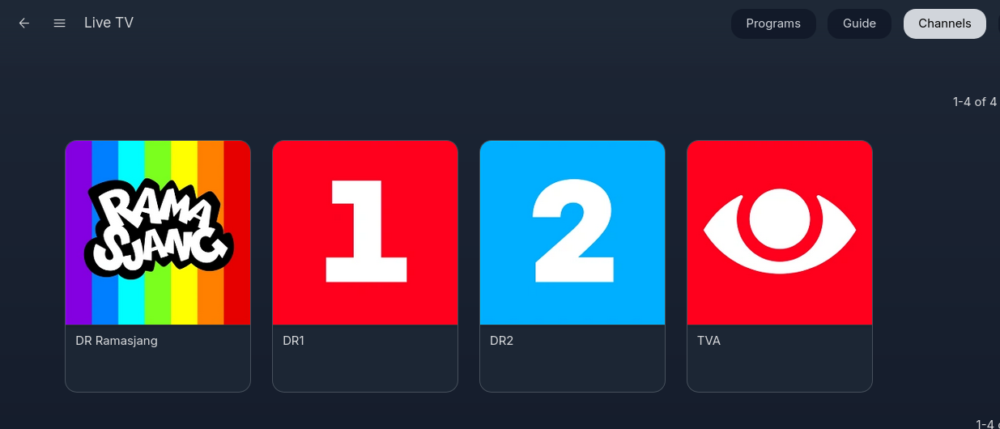
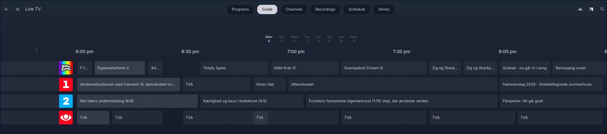
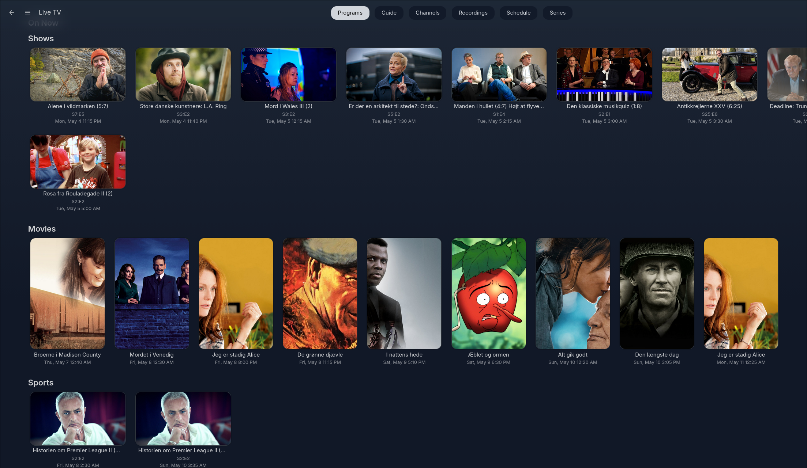

[](https://github.com/ha1fdan/jellyfinTVxml/actions/workflows/docker.yml) [](https://github.com/ha1fdan/jellyfinTVxml/blob/main/LICENSE) [](#) [](#) [](#) 


# jellyfin-tvxml

A lightweight Docker service that provides Jellyfin with a live TV channel list (M3U) and programme guide (XMLTV) sourced from DR's schedule API.

- Fetches EPG data directly from DR and serves it as standard XMLTV
- Streams are proxied locally so Jellyfin can reach CDN-hosted HLS streams
- Friendly channel names (e.g. `DR1`) instead of numeric API IDs
- Optional HTTP proxy support for outbound requests

## Endpoints

| Endpoint | Description |
|---|---|
| `GET /epg.xml` | XMLTV programme guide (7 days by default) |
| `GET /epg.xml?days=3` | Override number of days |
| `GET /channels.m3u` | M3U playlist for Jellyfin Live TV tuner |

## Setup

### 1. Configure your streams

Create `streams.json` with the channels you want. The key is the name Jellyfin will see:

```json
{
  "DR1": "https://drlivedr1hls.akamaized.net/hls/live/2113625/drlivedr1/master.m3u8"
}
```

If the key differs from DR's internal channel ID (it will for friendly names), create `channel_ids.json` to map them:

```json
{
  "DR1": "20875"
}
```

This lets the server fetch EPG data using the correct DR API ID while exposing the friendly name to Jellyfin.

### 2. Run with Docker Compose

**Option A — pull the pre-built image from GitHub Container Registry:**

```yaml
services:
  jellyfin-tvxml:
    image: ghcr.io/ha1fdan/jellyfin-tvxml:latest
    container_name: jellyfin-tvxml
    restart: unless-stopped
    ports:
      - "8765:8765"
    volumes:
      - ./streams.json:/app/streams.json:ro
      - ./channel_ids.json:/app/channel_ids.json:ro
```

```bash
docker compose up -d
```

**Option B — build locally:**

```bash
git clone https://github.com/ha1fdan/jellyfinTVxml.git
cd jellyfinTVxml
docker compose up -d --build
```

The service listens on port `8765`.

### 3. Channel logos (optional)

Create `logos.json` to map channel keys to logo image URLs:

```json
{
  "DR1": "https://example.com/logos/dr1.png",
  "DR2": "https://example.com/logos/dr2.png"
}
```

Mount it alongside the other config files:

```yaml
volumes:
  - ./logos.json:/app/logos.json:ro
```

### 4. Environment variables (optional)

Copy `.env.example` to `.env` and set any of the following:

| Variable | Description |
|---|---|
| `HTTP_PROXY` / `HTTPS_PROXY` | Route all outbound requests through an HTTP proxy |
| `EPG_CACHE_TTL` | Seconds to cache EPG data before re-fetching from DR (default: `3600`) |
| `PROXY_STREAMS` | Set to `true` to route HLS streams through the local proxy (default: `false` — Jellyfin fetches streams directly) |
| `PROXY_IMAGES` | Set to `true` to proxy channel logos and programme thumbnails through the local server (useful if Jellyfin can't reach external image hosts) |

The `compose.yml` loads `.env` automatically if present.

## Adding to Jellyfin

1. In Jellyfin, go to **Dashboard > Live TV**
2. Add a **TV Tuner** — choose **M3U Tuner** and set the URL to:
   ```
   http://<host-ip>:8765/channels.m3u
   ```
3. Add a **TV Guide Data Provider** — choose **XMLTV** and set the URL to:
   ```
   http://<host-ip>:8765/epg.xml
   ```
4. Save and let Jellyfin refresh the guide.



*XMLTV guide data provider configured with the local EPG endpoint and category mappings.*

## Screenshots



*Channels view — DR channel logos are fetched automatically and displayed in Jellyfin.*



*Programme guide — 7 days of schedule data sourced from the DR API.*



*Programs view — EPG categories (movies, children's, news, sports) are mapped so Jellyfin can sort content correctly.*
